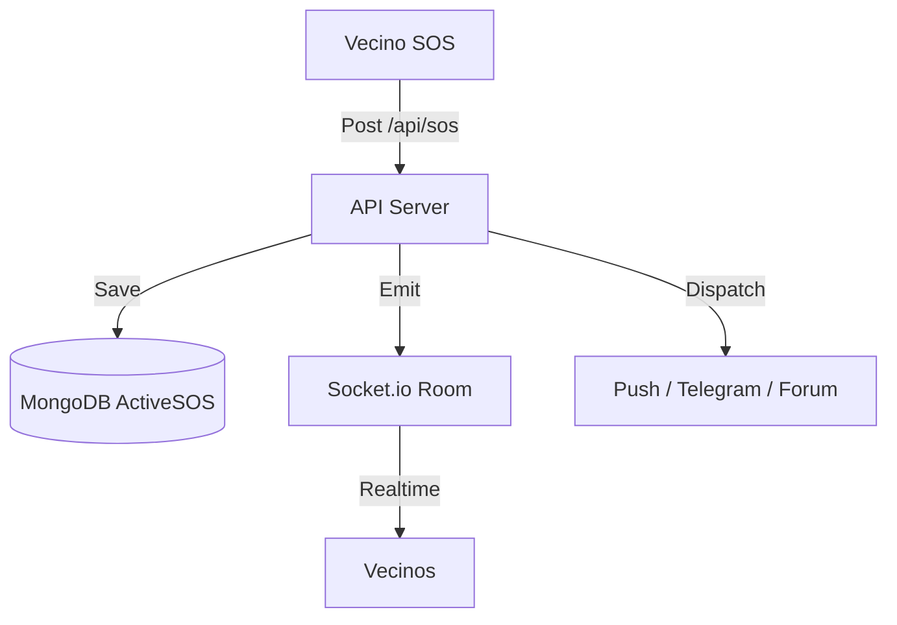

# Estructura Técnica y Arquitectura: PatrolHood v4.0 Pro+ (Excelencia)

Arquitectura profesional de alta disponibilidad con servicios resilientes y aislamiento multi-tenant estricto.

## 1. Núcleo de Seguridad y Aislamiento (Multi-tenant)
El sistema ha migrado de una estructura simple a un entorno de arrendamiento múltiple (multi-tenant) profesional:

- **Identidad UUID**: Uso de `communityId` (UUID v4) como clave primaria para el aislamiento de datos.
- **Autenticación JWT**: Implementación de tokens firmados que encapsulan la identidad del usuario y su pertenencia comunitaria.
- **Middleware de Protección**: Capa `checkCommunity` que garantiza que las peticiones API solo operen sobre recursos permitidos para el tenant actual.

## 2. Resiliencia SOS y Persistencia
Se ha implementado una arquitectura de "Cerrado de Fallos" para emergencias:

- **Persistencia ActiveSOS**: Las alertas se registran en MongoDB antes de su difusión. Esto permite recuperar el estado del mapa de emergencias tras un reinicio del servidor.
- **Manejo de Ciclo de Vida**: Los SOS tienen un flujo controlado de inicio y fin, con validación de roles para la detención de alertas.
- **Recuperación Automática**: Al arrancar, el servidor escanea alertas activas y restaura las salas (rooms) de Socket.io correspondientes.

## 3. Capacidades PWA y Soporte Offline
Resiliencia de cliente para situaciones de baja conectividad:
- **Buffer Local (IndexedDB)**: Uso de Dexie.js para almacenar alertas pendientes si no hay red.
- **Sincronización en Background**: Reintento automático de envío cuando se restaura la conexión.
- **UX de Instalación**: Flujo nativo de instalación para dispositivos móviles.

## 4. Moderación y Observabilidad
Herramientas para la gestión comunitaria profesional:
- **Audit Logs**: Registro trazable de todas las operaciones administrativas críticas.
- **Dashboard Administrativo**: Interfaz dedicada para visualización de logs y métricas de comunidad.
- **Moderación en Tiempo Real**: Capacidad de borrado de mensajes del foro con actualización instantánea vía sockets.
- **Telemetría de Latencia**: Monitorización estructurada del tiempo de respuesta de cada endpoint.

---

### Bus de Eventos y Estados

---
*Manual de Arquitectura de Excelencia - v4.0 Pro+ (2026)*
